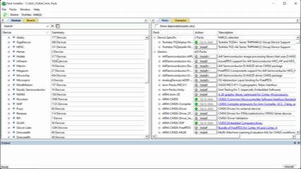

# Documentation

Reference material, test evidence, setup notes, and analysis tooling for the
Toshiba micromouse.

## Contents

| Folder | Contents |
|--------|----------|
| [`assets/`](assets/) | Images used across the docs — diagrams, photos, screenshots. |
| [`evidence/`](evidence/) | Module-testing evidence: a per-module checklist plus captured serial logs and videos. |
| [`matlab/`](matlab/) | Analysis scripts. `plot_pid.m` plots UART telemetry (setpoint vs. actual speed and controller output) for PID tuning. |

## Conventions

- Images referenced by any README live in `assets/` and are linked with a relative path.
- Test recordings and captured serial logs go in `evidence/`, one per module test.
- Analysis scripts read the comma-separated telemetry streamed by the firmware test harness (`ModuleTest.c`).

---

## Quick start

### 1. Install Keil MDK-ARM

uVision plus the Arm compiler. The free Community edition is enough for this
project's code size.

### 2. Add the device pack

Pack Installer &rarr; search `TMPM4K` &rarr; install the Toshiba M4K device family pack.



> **The pack ships Arm Compiler 5 project files only.** uVision defaults to
> Arm Compiler 6, and an AC5 project will not build against it.

### 3. Get the Toshiba peripheral sample

Download `TMPM4KyA_common_sample_v2.2.0.zip` from the
[M4K sample software page](https://toshiba.semicon-storage.com/us/semiconductor/product/microcontrollers/software-library/txzplus-m4k-group.html)
(*Peripheral Sample Software* section). These project files **do** support Arm
Compiler 6 — use them as the base rather than the pack's.

The samples also map onto the drivers in this project:

| Sample | Driver here |
|--------|-------------|
| `A_ENC32` | `drivers/encoder32A.c` |
| `T32A` | `drivers/timer32A.c` — PWM and the 1 kHz tick |
| `ADC` | `drivers/adc.c` — IR receivers |
| `UART` | `drivers/uart.c` — telemetry |
| `PORT` | `drivers/gpio.c` — IR emitters |

### 4. Pick which `main()` builds

There are two: `main.c` (the robot) and `ModuleTest.c` (the test harness).
Building both gives a linker error:

```
L6200E: Symbol main multiply defined
```

In the Project pane, right-click the file you do **not** want &rarr;
*Options for File* &rarr; untick **Include in Target Build**.

| Goal | Build | Exclude |
|------|-------|---------|
| Run the maze | `main.c` | `ModuleTest.c` |
| Run a module test | `ModuleTest.c` | `main.c` |

For a module test, also uncomment exactly one `#define` at the top of
`ModuleTest.c`. See the [test README](../src/README.md).

### 5. Connect the debugger

| Item | Detail |
|------|--------|
| Probe | External CMSIS-DAP |
| Level shifter | TXB0104 between probe and target |
| Target supply | 5 V &mdash; **required**, the ADC does not work below it |

Options for Target &rarr; Debug &rarr; select CMSIS-DAP, then Settings and confirm the
device is detected before flashing.

### 6. Build and flash

`F7` to build, `F8` to download.

### 7. Open a serial terminal

Telemetry streams as comma-separated text.

| Setting | Value |
|---------|-------|
| Baud | 115200 |
| Format | 8-N-1 |
| Flow control | none |

TeraTerm or PuTTY both work. Log to file if you want to plot the run with
`matlab/plot_pid.m`.

## Troubleshooting

| Symptom | Cause |
|---------|-------|
| `L6200E: Symbol main multiply defined` | Both `main.c` and `ModuleTest.c` in the build — see step 4 |
| Compiler errors in Toshiba headers | AC5 project files under AC6 — see step 3 |
| ADC reads zero or noise | Target not at 5 V |
| No serial output | Wrong COM port, or `UART_Init()` not called for the active test |