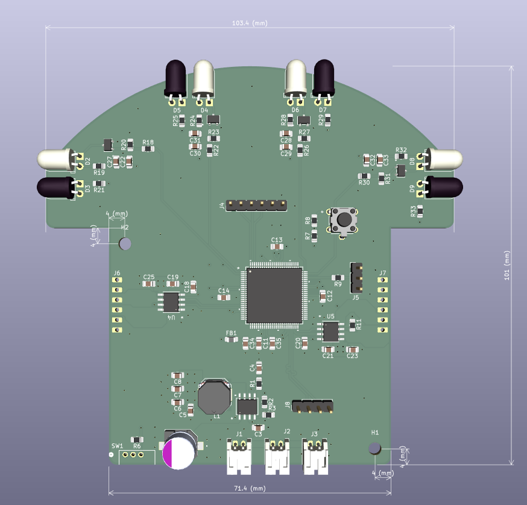
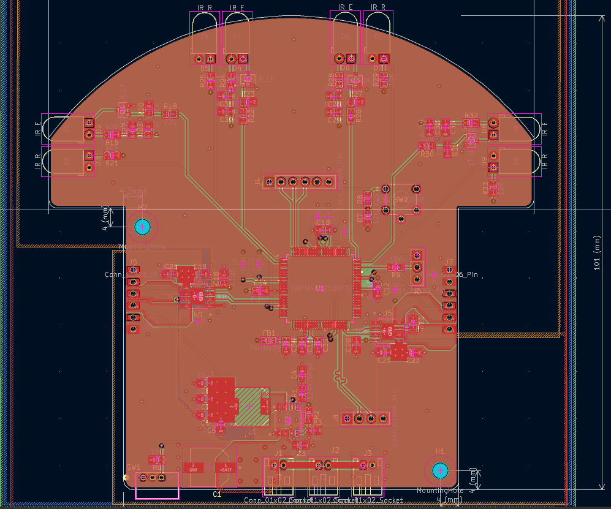
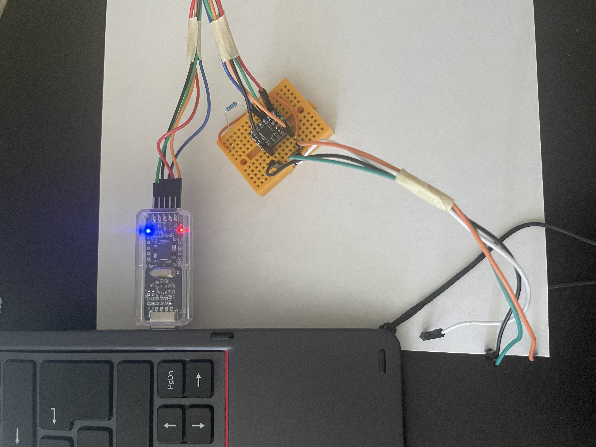
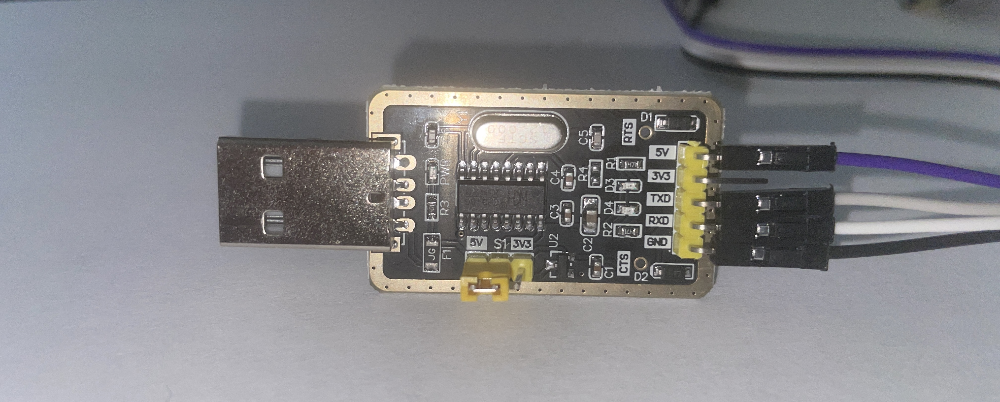

# Micromouse PCB

**Custom 4-Layer Control Board**  
*Integrated MCU, motor drivers, and IR sensing*

---

## Overview

The mainboard is a custom 4-layer PCB designed in KiCad that carries the full electronics stack on a single micromouse-sized board: the microcontroller, dual motor drivers, four IR wall sensors, and the power and debug interface.

---

## Board Specs

| Spec | Detail |
|------|--------|
| Layers | 4-layer |
| MCU | Toshiba TMPM4KNF10AFG (Cortex-M4F) |
| Motor drivers | 2 × TB67H450AFNG H-bridge |
| Sensing | 4 × IR emitter / receiver pairs |
| Debug | CMSIS-DAP (SWD) via TXB0104 level shifter |
| Battery | 3S LiPo, 11.1 V nominal |
| Logic supply | 5 V from a buck converter |

---

## Power

| Rail | Source | Notes |
|------|--------|-------|
| Motor | 3S LiPo, direct | 12.6 V charged, 11.1 V nominal, ~9.9 V cutoff |
| Logic | Buck converter to 5 V | The ADC needs 5 V, it does not work below it |

The gearmotors are the 12 V variant, so a 3S pack drives them at close to rated
voltage with nothing in between. Only the logic rail needs converting.

That conversion uses a switching regulator rather than a linear one. An LDO
dropping 11.1 V to 5 V burns the 6.1 V difference as heat:

| | LDO | Buck |
|---|---|---|
| Dissipation at 200 mA | 1.22 W | ~0.11 W |
| Efficiency | 45% | ~90% |

On a board this size, a watt of continuous heat is not something you want to
design around.

> Worth knowing during tuning: the pack falls from 12.6 V to about 9.9 V over a
> run, so motor voltage swings roughly 21%. The speed loop absorbs that through
> its integrator, but any open-loop duty figure is only valid at the charge state
> it was measured at.

---

## Layout

*Copper layers and component placement*

---

## Key Components

| Component | Part | Role |
|-----------|------|------|
| MCU | TMPM4KNF10AFG | Cortex-M4F, control & sensing |
| Motor driver | TB67H450AFNG ×2 | Brushed DC H-bridge, PWM speed control |
| Motors | Pololu #5211 N20 30:1 | Drive, with quadrature encoders |
| IR sensing | IR LED + phototransistor ×4 | Wall detection via ADC |
| Level shifter | TXB0104 | 5 V ↔ 3.3 V for SWD debug |

---

## Bench Setup

External equipment used for programming and debug:

 &nbsp;&nbsp; 

*SWD debug via level shifter, and USB-UART for serial logging*

| Equipment | Purpose |
|-----------|---------|
| CMSIS-DAP probe | SWD programming & debug |
| Logic level shifter | 5 V ↔ 3.3 V for the SWD lines |
| USB-UART converter | Serial console (115200 8-N-1) over the CH340G/debug UART |

Note: TXB0104 OE has a Pull-up. Recommended: 10k - 50k Ohms 

---

## Redesign Notes

Ideas for anyone rebuilding this board, roughly ordered by how much they save.

### Drop to 2 layers

The 4-layer stackup buys a solid ground plane and easy routing. A 2-layer board
runs about half the price at most fabs, and the component count here is low
enough to make it workable. Plan the ground pour carefully around the ADC inputs
if you do.

### Use a 64-pin MCU

The M4K group ships in packages from 64 to 100 pins. This build uses roughly
twenty. A smaller package costs less and frees board area, which is the other
half of shrinking the board.

### Remove the encoder pull-ups

The Pololu encoder board already pulls channels A and B to Vcc through 10 kΩ.
On-board pull-ups parallel those down to 5 kΩ, which works but does nothing
useful. Four resistors saved.

### Hardwire BOOT_N

The bridge connector only matters if you need the built-in serial bootloader.
With SWD programming it never moves, so a 10 kΩ pull-up in its place removes a
connector and an assembly step.

Trade-off: the bootloader is your recovery path if the SWD pins ever get
misconfigured. Losing it means a bad flash is harder to walk back.

### 6 V motors and an LDO

Pololu's 6 V and 12 V HPCB motors perform identically at their own rated
voltages. The 6 V version just draws twice the current. That opens up a 2S pack
with an LDO, dropping 2.4 V instead of 6.1 V, and an LDO is one part rather than
a controller, an inductor, and a capacitor bank.

Trade-off: double the motor current through the H-bridges, and the LDO still runs
warmer than a buck. Cheaper and simpler, not better.

### One dual-channel motor driver

Two single H-bridges could be one dual package. Fewer parts, less area, lower
cost. Check the voltage rating against your pack first, plenty of common dual
drivers top out below a charged 3S.

---

## Schematic

The full schematic is available as a PDF:

[View schematic (PDF)](Schematic.pdf)

---

## Design Files

| File | Contents |
|------|----------|
| [`TMPM4KNF10AFG.kicad_sch`](TMPM4KNF10AFG.kicad_sch) | Schematic source (KiCad) |
| [`TMPM4KNF10AFG.kicad_pcb`](TMPM4KNF10AFG.kicad_pcb) | Board layout source (KiCad) |
| [`Schematic.pdf`](Schematic.pdf) | Rendered schematic |
| [`board.step`](board.step) | 3D board model (STEP) |
| [`BOM.csv`](BOM.csv) | Bill of materials |
| [`gerber/`](gerber/) | Fabrication outputs |

---

[← Back to hardware README](../README.md)

