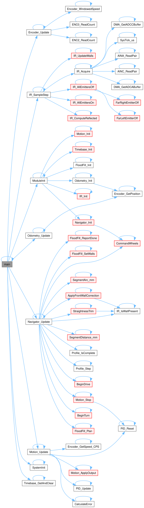
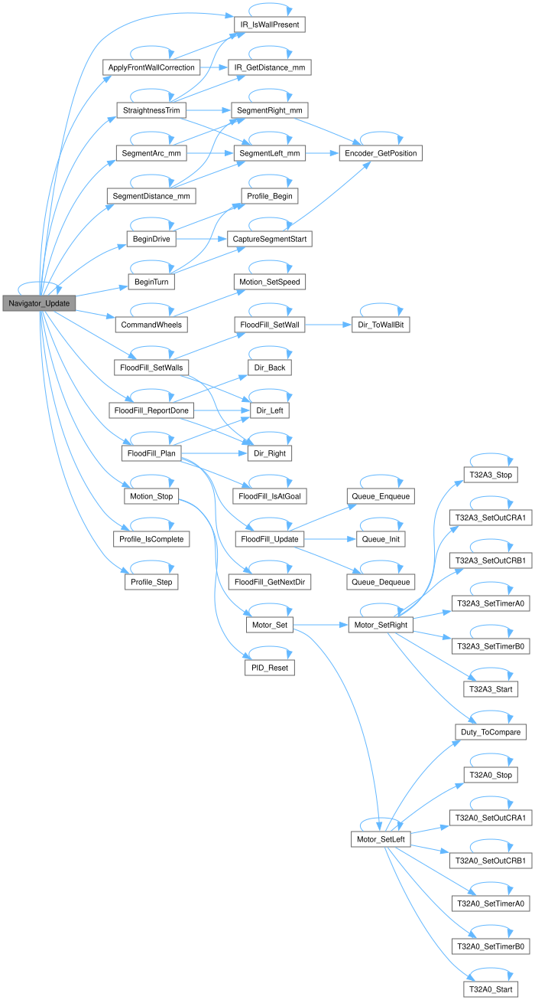

# 🐭 Toshiba Micromouse Firmware

```
    ╔══════════════════════════════════════════╗
    ║  ┌─────────┐    ┌─────────┐              ║
    ║  │  LEFT   │    │  RIGHT  │              ║
    ║  │  MOTOR  │    │  MOTOR  │              ║
    ║  │  T32A0  │    │  T32A3  │              ║
    ║  └────┬────┘    └────┬────┘              ║
    ║       │              │                   ║
    ║  ┌────┴──────────────┴────┐              ║
    ║  │    TMPM4KNF10AFG       │              ║
    ║  │    Cortex-M4 @ 160MHz  │              ║
    ║  │    ┌───────────────┐   │              ║
    ║  │    │  1kHz Control │   │              ║
    ║  │    │  Loop (T32A1) │   │              ║
    ║  │    └───────────────┘   │              ║
    ║  └────────────────────────┘              ║
    ║       │              │                   ║
    ║  ┌────┴────┐    ┌────┴────┐              ║
    ║  │  ENC0   │    │  ENC2   │              ║
    ║  │  Left   │    │  Right  │              ║
    ║  └─────────┘    └─────────┘              ║
    ╚══════════════════════════════════════════╝
```

---

## Architecture

Everything is driven by a single 1 kHz control tick. Each tick runs five stages
in order, and each stage consumes the output of the one above it. The maze
planner (`FloodFill`) is pure logic and never touches hardware. `Navigator` owns
all motion and calls the planner for decisions.

`Navigator` runs before `Motion` so the setpoint it produces is acted on within
the same tick rather than one tick late.

```
┌──────────────────────────────────────────────────────────────┐
│                          main.c                              │
│   while(1) {                                                 │
│     if (Timebase_GetAndClear()) {   ◄── 1 kHz tick           │
│       Encoder_Update();    // read encoders, filter speed    │
│       Odometry_Update();   // pose (x, y, heading)           │
│       IR_SampleStep();     // advance the IR sampler         │
│       Navigator_Update();  // plan/turn/drive FSM step       │
│       Motion_Update();     // PID -> motor PWM (non-blocking)│
│     }                                                        │
│   }                                                          │
└──────────────────────────┬───────────────────────────────────┘
                           │  once per tick
   ┌───────────┬───────────┼───────────┬────────────┐
   ▼           ▼           ▼           ▼            ▼
┌────────┐ ┌────────┐ ┌────────┐ ┌───────────┐ ┌──────────┐
│Encoder │ │Odometry│ │ Motion │ │ Navigator │ │ FloodFill│
│speed + │ │pose    │ │PID +   │ │ FSM:      │◄┤   BFS    │
│position│ │x,y,θ   │ │motor   │ │ plan→turn │ │ Algorithm│
└───┬────┘ └───┬────┘ └───┬────┘ │ →drive    │ └────┬─────┘
    │          │          │      └─────┬─────┘      │
    ▼          │          ▼            │            ▼
┌────────┐     │     ┌─────────┐       │       ┌──────────┐
│ENC0/2  │     │     │ Motor   │       │       │ IrSensor │
│A-ENC32 │     └────►│ TB67H450│       └──────►│ ADC      │
│quad in │           │ +T32A0/3│               │ 4× wall  │
└────────┘           │ PWM PPG │               │ sensing  │
                     └─────────┘               └──────────┘
```

**Control flow summary**

| Stage | Module | Role |
|-------|--------|------|
| 1 | `Encoder` | Read A-ENC32 counters(CPS) |
| 2 | `Odometry` | Integrate differential-drive pose from encoder deltas |
| 3 | `IrSensor` | Advance one phase of the ambient-cancelling sample cycle |
| 4 | `Navigator` | Non-blocking FSM. Asks `FloodFill` for moves, executes them |
| 5 | `Motion` | Per-wheel PID speed loop → `Motor` PWM duty |
| .. | `Profile` | Trapezoidal velocity profile. Called in `Navigator` |
| .. | `FloodFill` | Pure BFS planner over discovered walls (no hardware) |

---

## Project Structure

```
toshiba-micromouse/
├── keil/                     # Keil µVision project files
├── hardware/                 # Hardware overview for Mouse
├── docs/                     # Images and documentation assets
├── README.md                 # Project landing page
└── src/
    ├── README.md             # This file. Firmware architecture
    ├── main.c                # Entry point, 1 kHz control loop
    ├── ModuleTest.C          # Testing file 
    │
    ├── drivers/              # Register-level hardware layer
    │   ├── timer32A.c/h      # T32A: 20 kHz PWM (ch0/3) + 1 kHz tick (ch1)
    │   ├── gpio.c/h          # Port configuration + emitter GPIO
    │   ├── encoder32A.c/h    # A-ENC32 quadrature hardware read
    │   ├── adc.c/h           # ADC-I units A & C (IR receivers)
    │   ├── dma.c/h           # DMAC-B burst transfer for ADC (Optional)
    │   ├── uart.c/h          # UART-C serial debug output
    │   └── systick.c/h       # Blocking µs/ms delay (stateless)
    │
    └── modules/              # Application logic layer
        ├── Timebase.c/h      # 1 kHz tick flag service
        ├── Encoder.c/h       # Filtered speed + signed position
        ├── Odometry.c/h      # Differential-drive pose (x, y, θ)
        ├── PID.c/h           # Generic PID controller math
        ├── Motor.c/h         # TB67H450 H-bridge direction + duty
        ├── Motion.c/h        # PID speed loop bridging Encoder→Motor
        ├── Profile.c/h       # Trapezoidal velocity profile (mm, mm/s)
        ├── IrSensor.c/h      # IR sampling, ambient cancel, distance
        ├── FloodFill.c/h     # BFS flood-fill maze planner
        └── Navigator.c/h     # Cell-level motion sequencer (FSM)
```

---

## Hardware Specs

| Component | Part | Interface |
|-----------|------|-----------|
| **MCU** | TMPM4KNF10AFG | Arm Cortex-M4, 160 MHz, 5 V |
| **Motors** | TB67H450AFNG + Pololu #5211 N20 30:1 | T32A PPG PWM @ 20 kHz |
| **Encoders** | A-ENC32 (on-chip) | Quadrature, 12 CPR × 29.89 ≈ 359/rev |
| **IR Sensors** | IR LED + phototransistor ×4 | ADC-I |
| **Debug** | CMSIS-DAP + Level Shifter (TXB0104) | SWD |

### Pin Map

```
    ┌─────────────────────────────────────────────┐
    │  PORT A  │ PA3  ──► T32A00OUTA  (Left PWM)  │
    │          │ PA4  ──► T32A00OUTB  (Left PWM)  │
    ├─────────────────────────────────────────────┤
    │  PORT C  │ PC2  ──► T32A30OUTA  (Right PWM) │
    │          │ PC3  ──► T32A30OUTB  (Right PWM) │
    ├─────────────────────────────────────────────┤
    │  PORT N  │ PN0  ──► ENC0A  (Left encoder)   │
    │          │ PN1  ──► ENC0B  (Left encoder)   │
    ├─────────────────────────────────────────────┤
    │  PORT D  │ PD3  ──► ENC2A  (Right encoder)  │
    │          │ PD4  ──► ENC2B  (Right encoder)  │
    ├─────────────────────────────────────────────┤
    │  PORT L  │ PL0  ──► AINA16  (Far Left IR)   │
    │          │ PL1  ──► AINA15  (Left IR)       │
    ├─────────────────────────────────────────────┤
    │  PORT J  │ PJ0  ──► AINC00  (Far Right IR)  │
    │          │ PJ1  ──► AINC01  (Right IR)      │
    ├─────────────────────────────────────────────┤
    │  PORT U  │ PU0  ──► Left IR Emitter         │
    │          │ PU1  ──► Far Left IR Emitter     │
    ├─────────────────────────────────────────────┤
    │  PORT G  │ PG4  ──► Far Right IR Emitter    │
    │          │ PG5  ──► Right IR Emitter        │
    └─────────────────────────────────────────────┘
```

---

## Timer Configuration

```
┌──────────────────────────────────────────────────────────────┐
│  T32A0 (Left Motor)     │  T32A3 (Right Motor)               │
│  ─────────────────────  │  ─────────────────────             │
│  Mode:     16-bit PPG   │  Mode:     16-bit PPG              │
│  Prescaler: 1:1         │  Prescaler: 1:1                    │
│  Frequency: 20 kHz      │  Frequency: 20 kHz                 │
│  Period:   4000 counts  │  Period:   4000 counts             │
│  Pins:     PA3, PA4     │  Pins:     PC2, PC3                │
│  Duty:     RG0 = 0-4000 │  Duty:     RG0 = 0-4000            │
├──────────────────────────────────────────────────────────────┤
│  T32A1 (Control Loop)                                        │
│  ─────────────────────                                       │
│  Mode:     32-bit Interval                                   │
│  Prescaler: 1:1                                              │
│  Frequency: 1 kHz                                            │
│  Period:   80000 counts  (80 MHz ΦT0)                        │
│  Interrupt: INTT32A01AC (NVIC)                               │
│  Flag:     T32A01AC_IRQ_Fire (volatile bool)                 │
└──────────────────────────────────────────────────────────────┘
```

---

## Navigation Model

`FloodFill` and `Navigator` use **relative** moves at their boundary, so only
one of them needs a compass.

- `FloodFill_Plan()` returns one of `FORWARD`, `TURN_LEFT`, `TURN_RIGHT`,
  `TURN_AROUND`, `STOP`. It owns the grid cell and heading, and it is the only
  module that does.
- `Navigator` holds **no heading**. Every move is a *segment*, a fixed length of
  wheel path measured from encoder positions latched at segment start.
- Odometry is not read by `Navigator` at all. It uses `Odometry.h` for the
  geometry constants and nothing else.

**Segments**

| Type | Wheels | Length |
|------|--------|--------|
| Drive | both forward | `CELL_SIZE_MM` |
| Turn | opposed | `θ × WHEELBASE_MM / 2` per wheel |

A pivot is an arc, so it is a straight-line profile in disguise. One `Profile`
serves both, which is why there is no separate angular controller.

**FSM**

```
NAV_PLAN → NAV_TURN → NAV_DRIVE → NAV_SETTLE → NAV_PLAN
    ↓
NAV_FINISHED
```

`NAV_TURN` is skipped when the action is `FORWARD`. `NAV_SETTLE` holds the robot
still so the IR filter converges on the cell it stopped in before `NAV_PLAN`
reads walls from it.

**Correction**

Dead reckoning drifts, so the maze walls are the absolute reference.

- Side IR keeps the robot centred in a corridor, damped by encoder skew
- Front IR resets distance error at any cell facing a wall
- Both fall back to encoder-only when no wall is in range

> **Invariant (load-bearing):** `FloodFill`'s direction enum must stay clockwise
> (N=0, E=1, S=2, W=3). `Dir_Right()` is `(dir + 1) & 3`. Renumbering it breaks
> every turn.

---

## Call Graphs

Generated with [Doxygen](https://www.doxygen.nl/) and rendered by
[Graphviz](https://graphviz.org/). Doxygen parses the source comments and emits
the browsable API docs; Graphviz draws the call and caller graphs.

Full documentation, with every function, its callers, and cross-referenced
source, opens at:

**[`docs/doxygen/html/index.html`](../docs/doxygen/html/index.html)**

Regenerate after changing the source:

```
doxygen Doxyfile
```

**`main()`**



**`Navigator_Update()`**



The graph shows every call the function can make, not which state makes it.
The FSM order is in [Navigation Model](#navigation-model).

---

## Build & Flash

```text
IDE:     Keil µVision
Target:  TMPM4KNF10AFG
Debug:   CMSIS-DAP
Flash:   On-chip 512 KB
```

---

## Deployment Calibration

Before real runs, these must be measured/tuned on the actual robot:

| Where | What | Why |
|-------|------|-----|
| `Encoder` | Forward → **increasing** position | Reversed sign turns PID into positive feedback (runaway) |
| `Odometry.h` | `WHEEL_DIAMETER_MM`, `COUNTS_PER_REV` | Sets `MM_PER_COUNT`. Wrong value scales every distance |
| `Odometry.h` | `WHEELBASE_MM` | Sets the arc length of a turn. Wrong value over or under rotates |
| `IrSensor.c` | `ir_cal[]` ADC→distance points | One table per channel. Wall detection and wall following both read it |
| `Navigator.c` | `IR_SIDE_TARGET_MM` | Side reading when centred. Only used when one wall is visible |
| `Navigator.c` | `IR_FRONT_TARGET_MM` | Front reading at a cell centre. Sets where a drive stops against a wall |
| `PID.h` | Gains for CPS-scaled error | Error is ~thousands (CPS); default `Kp` saturates instantly |

Angle depends on the *ratio* `MM_PER_COUNT / WHEELBASE_MM`, distance on
`MM_PER_COUNT` alone. Change the wheel and the wheelbase has to move with it or
every turn shifts by the same percentage.

Which test measures each value, and whether it has been done, is tracked in
[`docs/evidence/README.md`](../docs/evidence/README.md).

---

## Module Status

| Module | Status | Description |
|--------|--------|-------------|
| `Timebase` | Done | 1 kHz control tick flag |
| `Encoder` | Done | Filtered speed + signed position |
| `Odometry` | Done | Differential-drive pose estimate |
| `PID` | Done | Generic PID controller |
| `Motor` | Done | H-bridge direction + duty |
| `Motion` | Done | PID speed loop (Encoder→Motor) |
| `Profile` | Done | Trapezoidal velocity profile |
| `IrSensor` | Done | IR sampling, ambient cancel, distance |
| `UART` | Done | Serial debug output (TX) |
| `FloodFill` | Done | BFS flood-fill planner |
| `Navigator` | Done | Segment FSM + wall following |

---

## References

- [TMPM4KNF10AFG Product Page](https://toshiba.semicon-storage.com/us/semiconductor/product/microcontrollers/txz4aplus-series/m4k-group.html)
- [RM-T32A-C Timer Reference](https://toshiba.semicon-storage.com/info/RM-T32A-C_en_20241129.pdf)
- [RM-A-ENC32-A Encoder Reference](https://toshiba.semicon-storage.com/info/RM-A-ENC32-A_en_20250221.pdf)
- [RM-ADC-I Reference](https://toshiba.semicon-storage.com/info/RM-ADC-I_en_20251205.pdf)
- [RM-DMAC-B DMA Reference](https://toshiba.semicon-storage.com/info/RM-DMAC-B_en_20241031.pdf)
- [Pololu #5211 Motor Datasheet](https://www.pololu.com/file/0J1487/pololu-micro-metal-gearmotors-rev-6-2.pdf)
- [Doxygen](https://www.doxygen.nl/) by Dimitri van Heesch, GPL-2.0
- [Graphviz](https://graphviz.org/), EPL-1.0

---

**Author:** Kevin Le &nbsp;•&nbsp; 2026